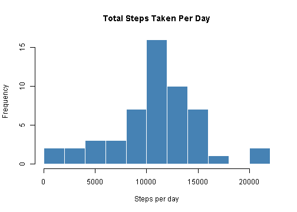
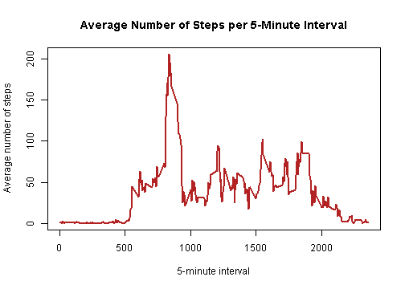
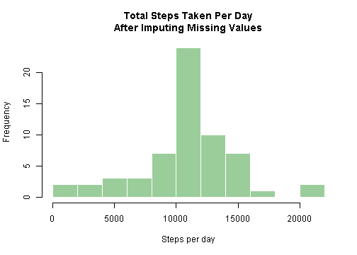
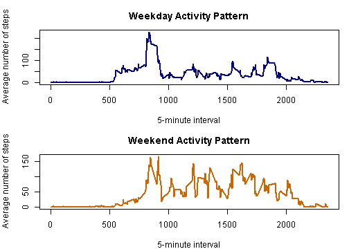

## Loading and preprocessing the data


``` r
summary(activity)
```

```
##      steps             date               interval     
##  Min.   :  0.00   Min.   :2012-10-01   Min.   :   0.0  
##  1st Qu.:  0.00   1st Qu.:2012-10-16   1st Qu.: 588.8  
##  Median :  0.00   Median :2012-10-31   Median :1177.5  
##  Mean   : 37.38   Mean   :2012-10-31   Mean   :1177.5  
##  3rd Qu.: 12.00   3rd Qu.:2012-11-15   3rd Qu.:1766.2  
##  Max.   :806.00   Max.   :2012-11-30   Max.   :2355.0  
##  NA's   :2304
```

## What is mean total number of steps taken per day?


``` r
daily_totals <- aggregate(steps ~ date, data = activity, FUN = sum, na.rm = TRUE)

hist(
  daily_totals$steps,
  breaks = 12,
  col = "steelblue",
  border = "white",
  main = "Total Steps Taken Per Day",
  xlab = "Steps per day"
)
```



The mean total number of steps taken per day is 1.076619 &times; 10<sup>4</sup>.

The median total number of steps taken per day is 10765.

## What is the average daily activity pattern?


``` r
interval_means <- aggregate(steps ~ interval, data = activity, FUN = mean, na.rm = TRUE)

plot(
  interval_means$interval,
  interval_means$steps,
  type = "l",
  lwd = 2,
  col = "firebrick",
  main = "Average Number of Steps per 5-Minute Interval",
  xlab = "5-minute interval",
  ylab = "Average number of steps"
)
```



The 5-minute interval with the highest average number of steps is 835.

## Imputing missing values

The total number of missing values in the dataset is 2304.


``` r
filled_activity <- activity
interval_lookup <- setNames(interval_means$steps, interval_means$interval)
missing_rows <- is.na(filled_activity$steps)

filled_activity$steps[missing_rows] <- interval_lookup[as.character(filled_activity$interval[missing_rows])]

filled_daily_totals <- aggregate(steps ~ date, data = filled_activity, FUN = sum)

hist(
  filled_daily_totals$steps,
  breaks = 12,
  col = "darkseagreen3",
  border = "white",
  main = "Total Steps Taken Per Day\nAfter Imputing Missing Values",
  xlab = "Steps per day"
)
```



The mean total number of steps taken per day after imputation is 1.076619 &times; 10<sup>4</sup>.

The median total number of steps taken per day after imputation is 1.076619 &times; 10<sup>4</sup>.

Imputing missing values changes the distribution by replacing missing observations with the average value for each interval. In this dataset, the mean stays essentially the same while the median increases, which suggests that the imputed values mainly affect the center of the daily-total distribution rather than shifting the overall average.

## Are there differences in activity patterns between weekdays and weekends?


``` r
day_index <- as.POSIXlt(filled_activity$date)$wday
filled_activity$day_type <- ifelse(day_index %in% c(0, 6), "weekend", "weekday")
filled_activity$day_type <- factor(filled_activity$day_type, levels = c("weekday", "weekend"))

day_interval_means <- aggregate(steps ~ interval + day_type, data = filled_activity, FUN = mean)

par(mfrow = c(2, 1), mar = c(4, 4, 3, 1))

with(
  subset(day_interval_means, day_type == "weekday"),
  plot(
    interval,
    steps,
    type = "l",
    lwd = 2,
    col = "navy",
    main = "Weekday Activity Pattern",
    xlab = "5-minute interval",
    ylab = "Average number of steps"
  )
)

with(
  subset(day_interval_means, day_type == "weekend"),
  plot(
    interval,
    steps,
    type = "l",
    lwd = 2,
    col = "darkorange3",
    main = "Weekend Activity Pattern",
    xlab = "5-minute interval",
    ylab = "Average number of steps"
  )
)
```



The weekday pattern shows a sharper morning peak, while weekend activity is more spread out through the day.
